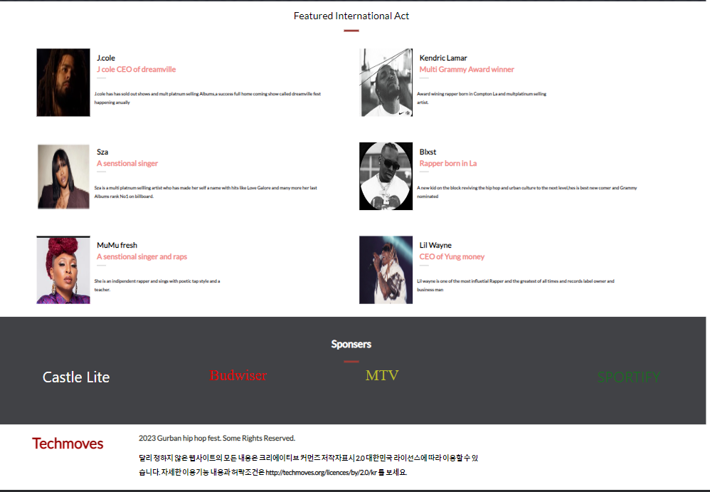
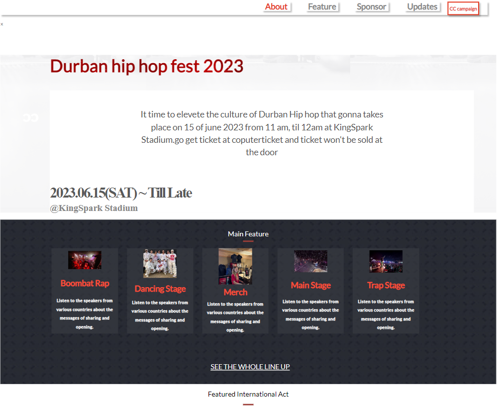

  <h1><b>capstone Project</b></h1>

<!-- TABLE OF CONTENTS -->

# 📗 Table of Contents

- [📖 About the Project](#about-project)
  - [🛠 Built With](#built-with)
    - [Tech Stack](#tech-stack)
    - [Key Features](#key-features)
    - [🚀 Live Demo](#live-demo)
- [💻 Getting Started](#getting-started)
  - [Setup](#setup)
  - [Prerequisites](#prerequisites)
  - [Install](#install)
  - [Usage](#usage)
  - [Run tests](#run-tests)
  - [Deployment](#triangular_flag_on_post-deployment)
- [👥 Authors](#authors)
- [🔭 Future Features](#future-features)
- [🤝 Contributing](#contributing)
- [⭐️ Show your support](#support)
- [🙏 Acknowledgements](#acknowledgements)
- [📝 License](#license)

<!-- PROJECT DESCRIPTION -->

# 📖 Durban Hip Hop fest 

> A "portfolio" HTML-5 & CSS3 repository built during the portal learning module.
> It is a show of my understanding of Gitflow, use of Linters, HTML5 semantics,java script, CSS3 flexbox, grid and figma.

## 🛠 Built With 

### Tech Stack 

- HTML-5
- CSS3
- Java Script
- Linters
- Figma

  
Client

  <ul>
    <li><a href="https://github.com/techmoves/my-portfolio/blob/htmlcss1/.github/workflows/linters.yml">Linters</a></li>
    <li><a href="https://www.w3schools.com/html/">HTML</a></li>
    <li><a href="https://www.w3schools.com/css/">CSS</a></li>
  </ul>

<!-- Features -->

### Key Features 

> Key features of the application.

- **Navigation bar in Header-Section**
- **Homepage of Personal Portfolio**

(<a href="#readme-top">back to top</a>)

<!-- LIVE DEMO -->
## 🚀 Live Demo 
  
  

> LIVE DEMO LINK.

deployment
- https://techmoves.github.io/hiphopfest-capstone/

(<a href="#readme-top">back to top</a>)

(<a href="#readme-top">back to top</a>)

<!-- GETTING STARTED -->

## 💻 Getting Started 

- To get a local copy up and running, follow these steps.

### Prerequisites

- You only need a browser to run the html file in.
-  A web browser: You will need a modern web browser such as Google Chrome, Mozilla Firefox, or Safari to view and test your project.
A code editor: You will need a code editor such as Visual Studio Code, Sublime Text, or Atom to write, edit, and manage your project's files.
A local server: You will need a local server such as XAMPP or WAMP to run your project locally and test it on your own computer.
Knowledge of HTML, CSS, and JavaScript: You will need to have a basic understanding of HTML, CSS, and JavaScript in order to build a web development project.
Familiarity with Git and GitHub: If you are using Git and GitHub to manage your project's codebase, you will need to be familiar with how to use them.

### Setup

- Create a new folder to store the files in.
- Open a command-line interface (e.g. Terminal on Mac or Linux, Command Prompt on Windows).
Navigate to the folder where you want to clone the repository using the cd command.
Use the git clone command followed by the repository's URL to clone the repository. For example: git clone https://github.com/techomoves/durban.hiphopfest.git
Press enter and wait for the repository to finish cloning.

### Install

Install this project with:

- Open your command prompt or terminal and run.

- git clone  https://github.com/techmoves/setup-mobile-first.git

- Clone the repository to your local machine using the git clone command as described in the previous answer.
Navigate to the project folder using a command-line interface such as Terminal or Command Prompt.
Install any necessary dependencies using a package manager such as NPM or Yarn. You can do this by running the npm install or yarn install command in the project folder.
Start the local server using a command such as npm start or yarn start, depending on the project's setup.
Open a web browser and navigate to the local server's URL to view and test the project.
-

### Usage

- Assuming that you have installed the project's dependencies and started the local server, you can run the project by following these steps:

Open a web browser such as Google Chrome, Mozilla Firefox, or Safari.
In the address bar, type the URL of the local server that you started in the previous step. This will typically be something like http://localhost:3000.
Press enter to navigate to the local server's URL.
The project should now be running in your web browser. Use the website's interface to interact with the project and test its functionality.

### Run tests

To run tests, run the following command:

- To run tests run :
- npx hint .
- npx stylelint "\*_/_.{css,scss}"

### Deployment

- Project is deployed using [GitHub Pages](https://techmoves.github.io/hiphopfest-capstone/)

<!-- AUTHORS -->

## 👥 Authors 

👤 ** Phelelani Ndlovu **

- GitHub: [@techmoves](https://github.com/techmoves)
- Twitter: @Dopezonke_
- LinkedIn: https://www.linkedin.com/in/phelelani-ndlovu-883916160/

(<a href="#readme-top">back to top</a>)

<!-- FUTURE FEATURES -->

## 🔭 Future Features 

> Features to be added:

- [X] **[Setup and mobile version]**
- [X] **[Mobile version]**
- [X] **[Contact form ]**
- [X] **[Desktop version]**
- [X] **[Improve mobile responsiveness]**
- [X] **[Application deploy]**
- [x] **[Evaluate accessibility ]**
- [x] **[Mobile menu ]**
- [x] **[Dynamic pages ]**

(<a href="#readme-top">back to top</a>)

<!-- CONTRIBUTING -->

## 🤝 Contributing 

Understand the project's goals: Before I start contributing to a project, it's important to understand its goals, scope, and target audience. Read the project's documentation and review its codebase to get a sense of what it does and how it works.

Create a new issue: If you I find an existing issue that matches your contribution, consider creating a new one. sure about the problem or feature request clearly and provide any relevant details or context.

Contributions, issues, and feature requests are welcome!

I'm happy to share my walk through to the project here is the link https://www.loom.com/share/59979d30d1b04be48898e4de063c5fa1

Feel free to check the [issues page](https://github.com/techmoves/setup-mobile-first/issues/3)

(<a href="https://techmoves.github.io/hiphopfest-capstone/">back to top</a>)

<!-- SUPPORT --> 

## ⭐️ Show your support 

Give a ⭐️ if you like this project!

If you like this project, please consider showing your support by starring the repository on GitHub! Your star helps to increase the project's visibility and encourages others to use and contribute to it. Additionally, if you find any issues or have any feature requests, please don't hesitate to submit them to the project's issues page. Your feedback and contributions are greatly appreciated and help to make the project better for everyone. Thank you for your support!
(back to top)

(<a href="#readme-top">back to top</a>)

<!-- ACKNOWLEDGEMENTS -->

## 🙏 Acknowledgments 

I would like to express my gratitude to the following individuals and resources who have inspired and contributed to this project:

[ ]cindy shin the author of the original design.This project is Creative Commons licensed.

(back to top)

Major thanks to [Cindy Shin in Behance](https://www.behance.net/adagio07)

(<a href="#readme-top">back to top</a>)

<!-- LICENSE -->

## 📝 License 

This project is [MIT](./LICENSE) licensed.

(<a href="#readme-top">back to top</a>)

